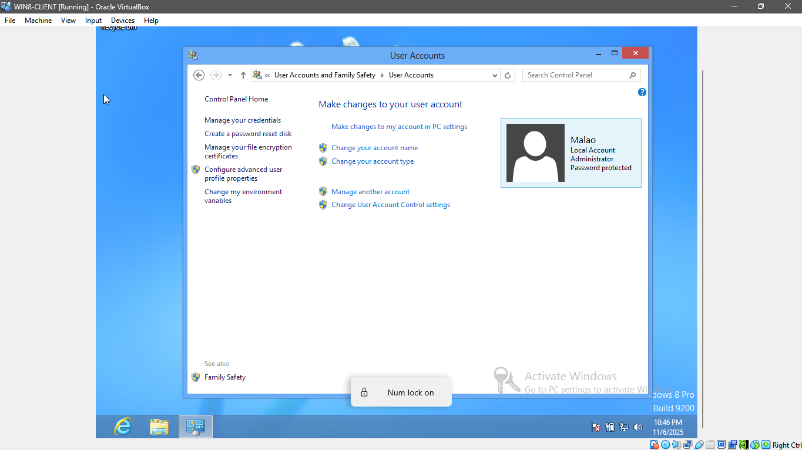
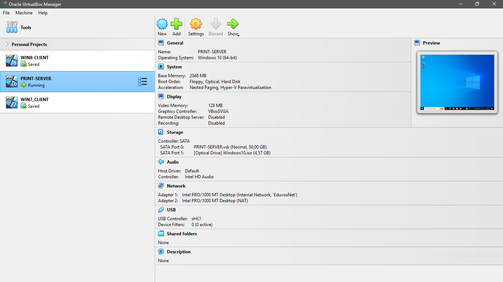
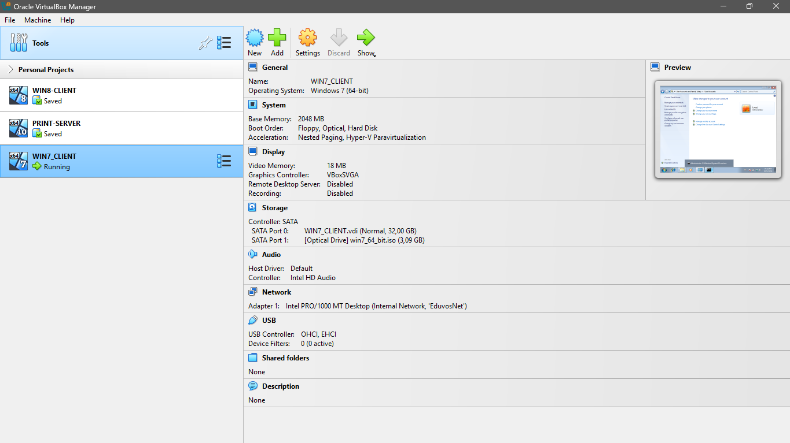
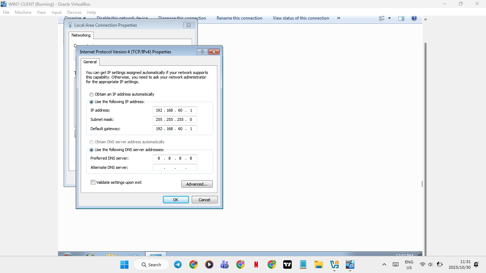
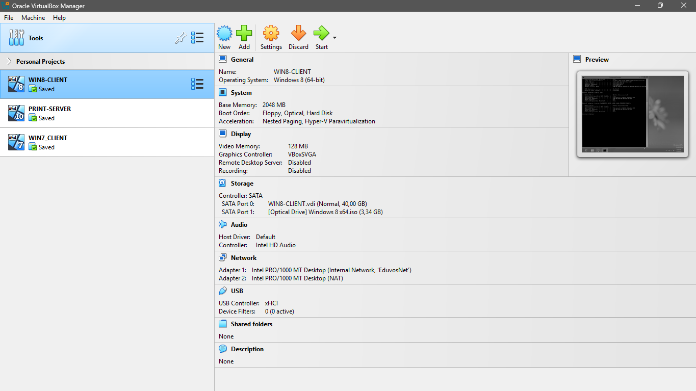
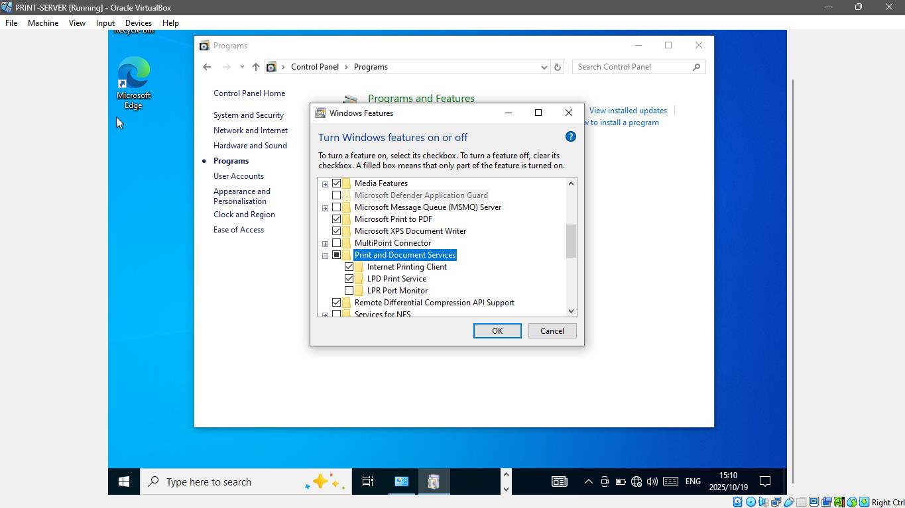
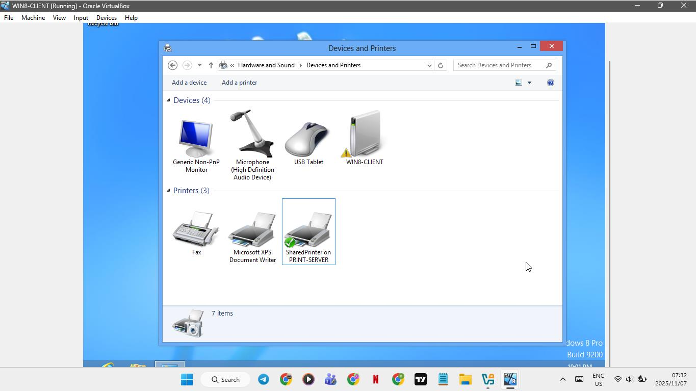
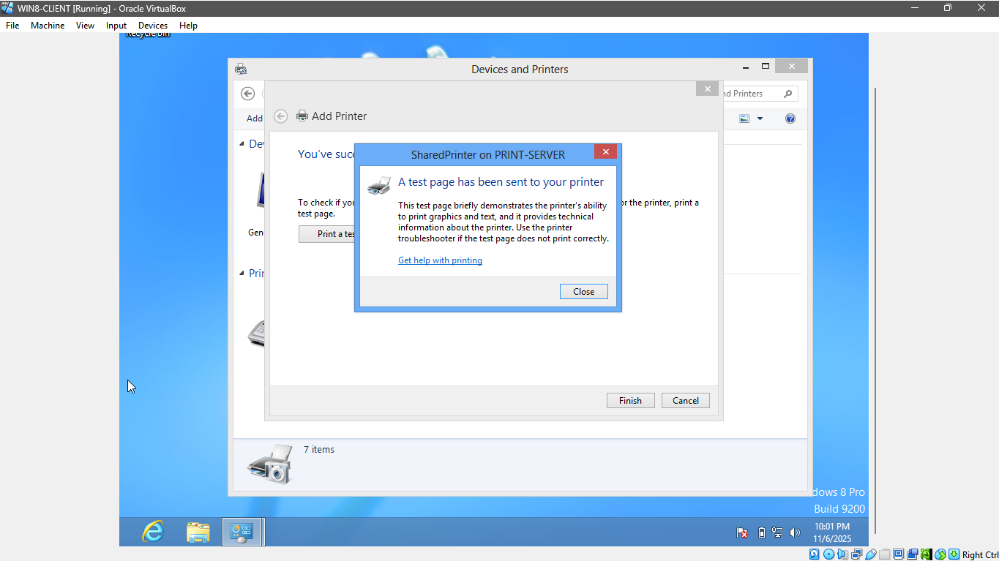

# SOHO Network Prototype

This project involved designing and implementing a virtualized Small Office/Home Office (SOHO) network using Oracle VirtualBox. The setup includes a centralized Print Server and two client machines, demonstrating core networking concepts such as static IP addressing, network service sharing, and address resolution.

## 🚀 Project Overview

- **Scenario:** Eduvos needed a prototype to enhance its campus IT support, specifically for printing services.
- **Objective:** Build a functional, small-scale office network in a virtual environment to simulate real-world administration tasks.
- **Key Skills Demonstrated:** Virtualization, Static IP Configuration, Network Service Setup (Print Server), Client-Server Connectivity, ARP Management.

## 🛠️ Technologies Used

- **Virtualization:** Oracle VirtualBox
- **Operating Systems:** Windows 7, Windows 8, Windows 10
- **Networking:** TCP/IP, Static IP Assignment, ARP, ICMP (Ping)
- **Tools:** Command Prompt, Windows Server Features

## 📋 Project Implementation

### 1: SOHO Network Configuration

#### 1.1 Virtual Machine Setup
Created three virtual machines with password-protected user accounts:

**WIN7-CLIENT User Account**


**WIN8-CLIENT User Account**  


**PRINT-SERVER User Account**


#### 1.2 Network Configuration
All VMs connected to the internal network "EduvosNet" with static IP addressing:

**PRINT-SERVER Network Setup**


**PRINT-SERVER Static IP Configuration**


**WIN7-CLIENT Network Setup**


**WIN7-CLIENT Static IP Configuration**


**WIN8-CLIENT Network Setup**


**WIN8-CLIENT Static IP Configuration**


#### 1.3 Print Server Configuration
Installed and configured network printing services:

**Enable Print and Document Services**


**Install Generic Text Printer**


**Share Printer as 'SharedPrinter'**


#### 1.4 Client Connectivity and Verification
Connected clients to shared printer and verified network connectivity:

**WIN7-CLIENT Printer Connection**


**WIN8-CLIENT Printer Connection**


**WIN7-CLIENT Test Page**


**WIN8-CLIENT Test Page**


**Network Connectivity Verification**


**File Explorer Access**


###2: Address Resolution Protocol (ARP) Management

#### 2.1a Static ARP Entry Configuration

**WIN8-CLIENT MAC Address Retrieval**


**Static ARP Entry Creation**


**Command Used:**
```cmd
arp -s 192.168.60.3 08-00-27-92-A9-DD
