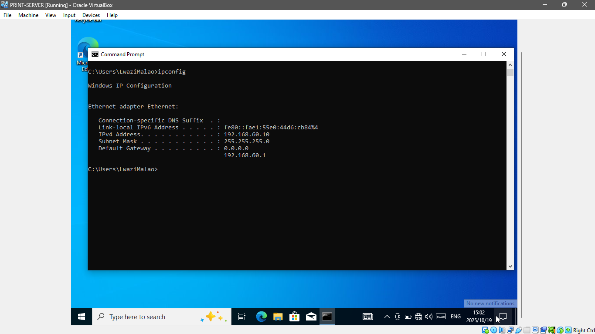
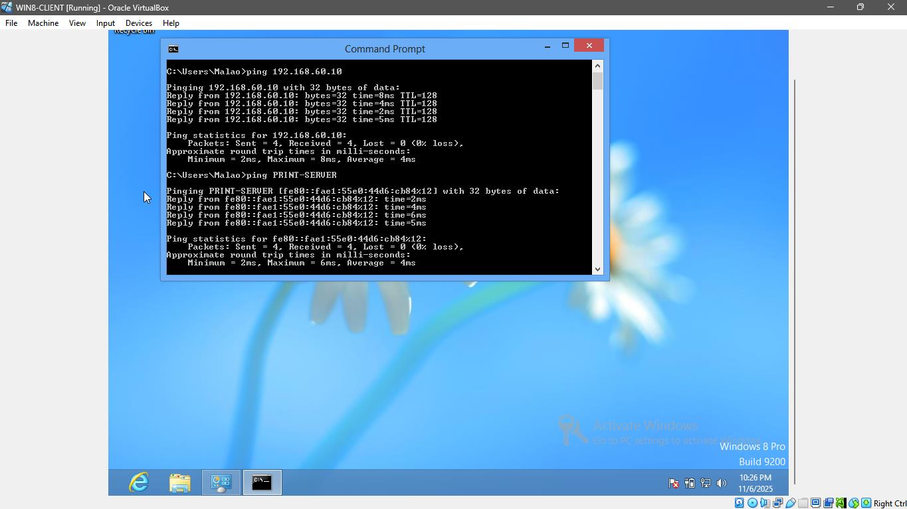
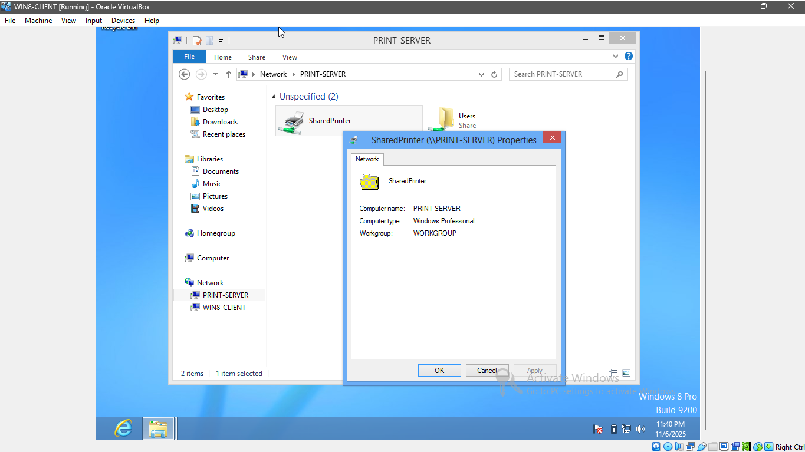

**Question** **1**

**Question** **1.1**

**Figure1.1:** Username "Malao" is password-protected

**Figure** **1.2:** Username setup "Lwazi" is password-protected

**Figure** **1.3:** Username setup "PrintServ" is password-protected

**Question** **1.2**

**Figure** **1.4** : PRINT-SERVER setup on internal network “EduvosNet”

**Figure** **1.5** **&** **1.6** **:** PRINT-SERVER assigned the static
IP addresses.

**Figure** **1.7:** WIN7-CLIENT setup on internal network “EduvosNet”

**Figure** **1.8** **&** **1.9:** WIN7-CLIENT assigned the static IP
addresses.

**Figure** **1.10:** WIN8-CLIENT setup on internal network “EduvosNet”

**Figure** **1.11&** **1.12:** WIN8-CLIENT assigned the static IP
addresses.

**Question** **1.3**

**Figure** **2.1:** Enabled ”Print and Document Services” in Control
Pane\>Programs and Features\>Turn Windows Features on or off

**Figure** **2.2:** Installed the printer and added a "Generic / Text
Only"

**Figure** **2.3:** Named printer 'SharedPrinter' and shared it.

**Question1.4:**

**Figure** **3.1** Connected WIN7-CLIENT to ”SharedPrinter” on
PRINT-SERVER

**Figure** **3.2** Connected WIN8-CLIENT to ”SharedPrinter” on
PRINT-SERVER

**Figure** **3.3** **:** Installed ”SharedPrinter” on WIN7-CLIENT and
printed test page

**Figure** **3.4:** Installed ”SharedPrinter” on WIN8-CLIENT and printed
test page

**Figure** **3.5:** WIN7-CLIENT successfully pinged the server by IP and
hostname

**Figure** **3.6:** WIN7-CLIENT successfully pinged the server by IP and
hostname

**Figure** **3.7:** accessed PRINT-SERVER via File Explorer using:
\\PRINT-SERVER and captured successful communication

**Figure** **3.7:** WIN8-CLIENT accessed PRINT-SERVER via File Explorer
using: \\PRINT-SERVER and captured successful communication

**Question** **2**

**Question** **2.1a**

**Figure** **4.1:** Used ”ipconfig /all” command to get MAC address of
WIN8-CLIENT

**Figure** **4.2** **:** Successfully added a static ARP entry, mapping
IP **192.168.60.3** to the MAC address **08-00-27-92-A9-DD** using the
”arp -s” command, followed by viewing the ARP cache with ”arp -a” to
confirm the static entry.

**Question** **2.1b**

Static ARP is often the preferred choice in stable, smaller networks or
critical devices like servers, printers and routers, where the IP to MAC
address mappings is well known and rarely changes. One of its advantages
is enhanced reliability, as it guarantees a device will always be
reachable at the correct hardware address, eliminating connectivity
issues that can arise from changing or corrupted ARP cache. This
approach also boosts performance and security. It removes the slight
delay and network traffic caused by broadcast ARP requests, and it
effectively immunizes the local host against ARP spoofing attacks, since
a malicious ARP reply cannot overwrite a manually entered static mapping
malicious ARP reply.
